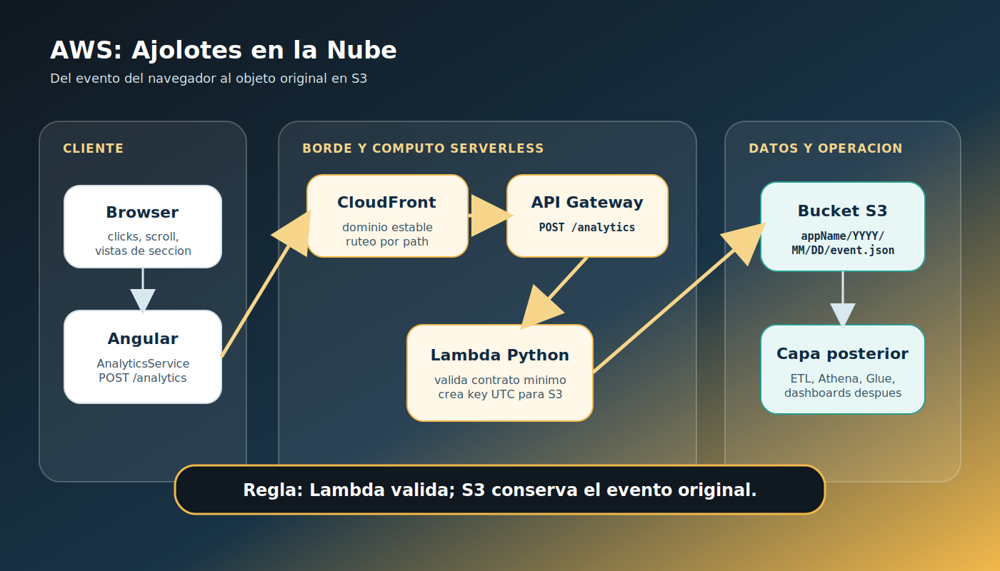
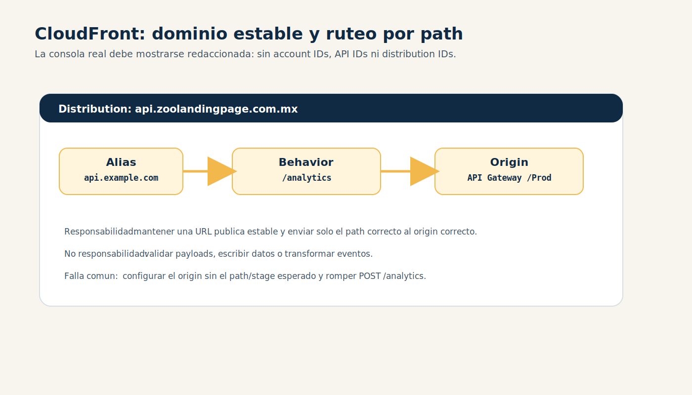
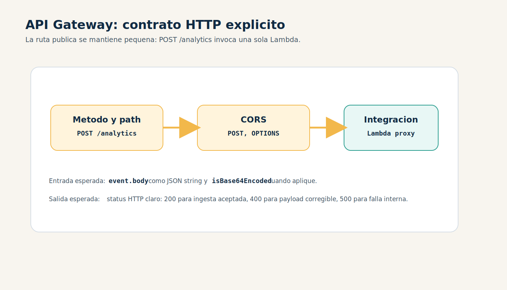
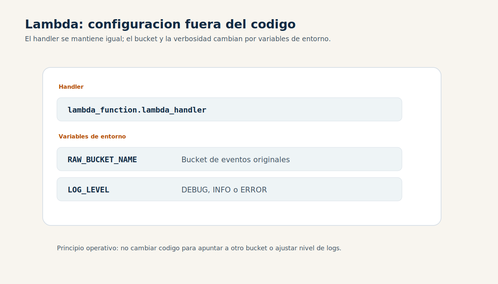
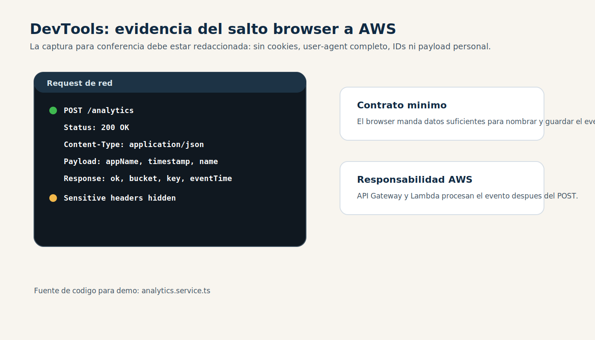

<!-- _class: invert -->

# AWS: Ajolotes en la Nube

### Un caso real de arquitectura serverless para analitica

#### Alec Jonathan Montano Romero (Lynx Pardelle)

Conferencia tecnica sobre AWS, analitica serverless y eventos sin transformar.

Muchas gracias a Clara por el espacio y la oportunidad.

---

## Arquitectura serverless de punta a punta

Una solucion AWS pequena puede cubrir toda la ruta de ingesta:

- entrada publica controlada
- contrato HTTP
- computo bajo demanda
- almacenamiento de eventos originales
- permisos minimos
- operacion y evolucion de datos

---

## Objetivo de la conferencia

Al final, la audiencia debe poder explicar:

- por que un evento del navegador no debe escribir directo a S3
- que rol cumple cada servicio AWS en el camino
- como se despliega el stack con SAM
- como se guarda el evento original sin perder flexibilidad
- donde entran IAM, CORS, CloudWatch, costos y futuros pipelines

> Tesis: una arquitectura serverless buena no es acumular servicios; es que cada servicio tenga una responsabilidad clara.

---

## Ruta de aprendizaje AWS

1. El problema: capturar senales sin construir una plataforma gigante.
2. El mapa AWS: edge, API, computo y almacenamiento.
3. Punto de entrada: Route 53, CloudFront y API Gateway.
4. Computo: Lambda Python como punto de control minimo.
5. Almacenamiento inicial: S3 conserva eventos originales.
6. Seguridad: IAM, CORS, payloads sensibles y permisos pequenos.
7. Operacion: SAM, logs, pruebas y costos.
8. Futuro: Athena, Glue, ETL y dashboards.

---

## Glosario AWS para no perder a nadie

| Termino | Como aparece en esta charla |
|---|---|
| Region | El despliegue SAM del repo apunta a `us-east-1`. |
| Edge | CloudFront recibe trafico cerca del usuario y rutea paths. |
| Origin | API Gateway funciona como destino HTTP detras de CloudFront. |
| Lambda | Ejecuta el handler Python bajo demanda. |
| S3 prefix | La key `appName/YYYY/MM/DD/...` organiza los eventos. |
| IAM role | Permite `s3:PutObject` al bucket destino. |
| SAM | Declara API Gateway, Lambda, CORS, memoria, timeout y output. |

Fuentes: `template.yaml`, `README.md`

---

## El caso real

Zoolandingpage es una plataforma de landing pages **config-driven**.

- Angular emite eventos como `page_view`, `cta_click`, `section_view` y `scroll_depth`.
- `zoolanding-data-dropper-lambda` recibe el evento y guarda el JSON original.
- La ruta publica esperada para frontend es `POST /analytics`.
- La Lambda no es un dashboard ni un ETL: solo valida, nombra y guarda el evento original.

Fuentes: `docs/developer_guide.md`, `docs/etl-starting-point.md`

---

<!-- _class: invert -->

## Ruta completa del evento en AWS



---

## Responsabilidades por capa AWS

| Capa | Servicio | Responsabilidad |
|---|---|---|
| Cliente | Browser + Angular | Genera eventos y manda `POST /analytics`. |
| Edge | CloudFront | Da dominio estable y ruteo por path. |
| API | API Gateway | Recibe la peticion HTTP y la entrega a Lambda. |
| Computo | Lambda | Valida minimo, calcula key y escribe a S3. |
| Almacenamiento | S3 | Conserva el payload original sin transformarlo. |
| Futuro | Athena/Glue/ETL | Consulta y transforma cuando ya haga falta. |

Fuentes: `README.md`, `template.yaml`, `docs/etl-starting-point.md`

---

## El frontend no debe cargar credenciales AWS

Enviar directo a S3 desde el navegador suena tentador, pero abre problemas:

- el cliente tendria que recibir credenciales o una firma temporal
- la validacion quedaria repartida
- CORS y permisos se vuelven parte de la experiencia publica
- cada cambio de almacenamiento se filtraria al frontend

La Lambda cuesta poco y crea un punto de control claro:

**browser habla HTTP; AWS escribe S3 con rol controlado**.

---

## CloudFront da una entrada publica estable

CloudFront no es la logica de analitica.

Su papel en este caso:

- sostener un dominio estable para el ecosistema
- rutear `/analytics` hacia la API correcta
- separar la URL publica del endpoint directo de API Gateway
- permitir que el frontend use una entrada consistente

Fuente: `README.md`

---

## CloudFront enruta dominio y paths



---

## API Gateway formaliza `POST /analytics`

API Gateway cumple tres tareas practicas:

- publica `POST /analytics`
- entrega a Lambda un evento compatible con proxy integration
- define CORS para `POST,OPTIONS`

En `template.yaml`, SAM declara la API con:

```yaml
StageName: Prod
AllowMethods: "'POST,OPTIONS'"
Path: /analytics
Method: POST
```

Fuente: `template.yaml`

---

## API Gateway conecta HTTP con Lambda



---

## Lambda ejecuta codigo bajo demanda

La Lambda no intenta entender toda la semantica de negocio.

Hace solo lo necesario para que el evento original sea confiable:

1. decodifica body normal o base64
2. parsea JSON
3. exige `appName` y `timestamp`
4. normaliza timestamp a milisegundos
5. deriva `YYYY/MM/DD` en UTC
6. guarda el body original en S3

Fuente: `lambda_function.py`

---

## Por que esa Lambda es buen ejemplo AWS

| Tema AWS | Donde aparece |
|---|---|
| Computo sin estado | El handler no depende de estado local persistente. |
| IAM limitado | La politica SAM solo permite `s3:PutObject` sobre el bucket destino. |
| Config externa | `RAW_BUCKET_NAME` y `LOG_LEVEL` viven como variables. |
| Logs operativos | `_log` emite JSON con requestId, appName, key y size. |
| Fallas claras | Validacion devuelve 400; errores internos devuelven 500. |

Fuentes: `lambda_function.py`, `template.yaml`

---

## La Lambda ejecuta un pipeline defensivo


Cada paso tiene una salida clara: validar, nombrar y guardar el evento original.

---

## Codigo: entrada defensiva

```python
def _decode_body(event):
    body = event.get("body")
    if body is None or body == "":
        raise ValueError("Missing body")
    if event.get("isBase64Encoded", False):
        if isinstance(body, str):
            return base64.b64decode(body).decode("utf-8")
        raise ValueError("Body is base64Encoded but not a string")
```

- API Gateway o invocadores compatibles pueden mandar body base64.
- Despues de esta funcion, el handler trabaja con `str`.

Fuente: `lambda_function.py`

---

## Codigo: timestamp sin suposiciones fragiles

```python
def _normalize_timestamp_to_ms(ts):
    if not isinstance(ts, (int, float)) or not math.isfinite(ts):
        raise ValueError("Missing or invalid timestamp")
    return int(ts if ts >= 10**12 else ts * 1000)
```

- Acepta epoch seconds y epoch milliseconds.
- La key final siempre usa milisegundos.
- La Lambda no inventa hora local si el cliente no manda `timezone`.

Fuente: `lambda_function.py`

---

## S3 conserva eventos sin transformar

S3 funciona bien aqui porque el patron solo agrega objetos:

- cada evento se guarda como objeto
- el body original no se reescribe
- la estructura de prefixes ayuda a leer por app y fecha
- ETL y consultas pueden venir despues

No se eligio S3 porque sea "la base de datos universal".

Se eligio porque permite guardar eventos originales con bajo costo y reprocesarlos despues.

---

## La key de S3 es parte del diseno


Contrato de almacenamiento: `s3://<bucket>/<appName>/<YYYY>/<MM>/<DD>/<timestampMs>-<requestId>.json`

Fuente: `docs/etl-starting-point.md`

---

## Ejemplo de evento a objeto

### Payload

```json
{
  "appName": "zoo_landing_page",
  "timestamp": 1756272600000,
  "timezone": "America/Mexico_City",
  "name": "cta_click"
}
```

### Key esperada

```text
zoo_landing_page/2025/08/27/1756272600000-567890ab.json
```

El sufijo viene del `aws_request_id`; en tests se usa `567890ab`.

Fuente: `tests/test_lambda_function.py`

---

## UTC para particiones, timezone para lectura humana

La Lambda separa dos problemas:

- **partition key**: se deriva en UTC para evitar drift por zona horaria o DST
- **viewer-local time**: se calcula solo si llega una IANA timezone valida
- **body original**: se queda sin mutar
- **metadata S3**: guarda `event-time-utc` y, si aplica, `event-time-local`

Esto evita que una decision de reporte rompa la estructura del almacenamiento.

Fuentes: `lambda_function.py`, `docs/etl-starting-point.md`

---

## Seguridad: donde esta el limite

| Riesgo | Decision en esta arquitectura |
|---|---|
| Credenciales en browser | No se exponen; el browser solo hace HTTP. |
| Permisos grandes | SAM limita el rol a `s3:PutObject`. |
| CORS accidental | CORS se declara en API Gateway. |
| Datos sensibles en eventos originales | El bucket debe tratarse como dato operacional sensible. |
| Hora local inferida | La Lambda no infiere timezone por IP, region o headers incompletos. |

Fuentes: `template.yaml`, `docs/etl-starting-point.md`

---

## IAM: el permiso que si hace falta

```yaml
Policies:
  - Statement:
      - Effect: Allow
        Action:
          - s3:PutObject
        Resource:
          Fn::Sub: arn:aws:s3:::${RawBucketName}/*
```

Para esta Lambda, leer, listar o borrar objetos no es parte del trabajo.

Ese recorte es una buena historia para explicar minimo privilegio con un caso concreto.

Fuente: `template.yaml`

---

## SAM: infraestructura como codigo

```yaml
Globals:
  Function:
    Runtime: python3.13
    Timeout: 10
    MemorySize: 256
    Tracing: PassThrough
```

SAM deja en el repo decisiones que si importan:

- runtime, memoria y timeout
- handler y variables de entorno
- CORS, ruta y stage
- permisos IAM

Fuente: `template.yaml`

---

## Variables de entorno separan codigo y operacion



Fuente: `template.yaml`

---

## Observabilidad: que se puede seguir

El handler emite logs JSON con campos operativos:

- `requestId`
- `appName`
- `timestampMs`
- `bucket`
- `key`
- `size`
- `eventTime`

En una demo AWS, el camino natural es:

**DevTools -> API Gateway -> Lambda logs -> S3 object**

Fuente: `lambda_function.py`

---

## DevTools confirma el salto browser -> AWS



---

## Costos sin inventar cifras

Sin una medicion actual, la conversacion responsable se centra en motores de costo:

- Lambda: invocaciones y duracion
- API Gateway: peticiones
- CloudFront: peticiones y transferencia
- S3: objetos, almacenamiento, peticiones y lifecycle
- CloudWatch: volumen de logs
- Athena futura: datos escaneados por consulta

La decision practica es controlar cardinalidad, logs y retencion.

---

## Escalabilidad: lo que crece bien

Este patron escala naturalmente cuando los eventos son independientes:

- eventos independientes
- escrituras de solo agregado
- particion por app y fecha
- procesamiento batch posterior

La ventaja principal es que la ruta de ingesta no necesita consultar estado compartido para aceptar un evento.

---

## Escalabilidad: riesgos a vigilar

El diseno sigue siendo simple, pero hay limites operativos que conviene monitorear:

- picos de trafico hacia API Gateway/Lambda
- exceso de objetos pequenos si el volumen crece mucho
- retencion de logs
- PII o geolocalizacion en payloads originales
- dashboards que consulten datos originales sin ETL

---

## ETL convierte eventos originales en analitica

Un pipeline posterior debe preservar el contrato de almacenamiento:

1. leer objetos por `appName` y rango UTC
2. parsear JSON y conservar `source_bucket` / `source_key`
3. agrupar por `sessionId` cuando exista
4. resolver timezone por sesion desde la primera IANA valida
5. producir una tabla normalizada para reportes

Fuente: `docs/etl-starting-point.md`

---

## Que mostraria en vivo

1. `template.yaml`: ruta, CORS, runtime, timeout, memoria e IAM.
2. `lambda_function.py`: decode, timestamp, timezone, key y `put_object`.
3. `tests/test_lambda_function.py`: key esperada y metadata.
4. DevTools: peticion real desde frontend.
5. AWS Console: API Gateway, variables de entorno de Lambda, S3 prefix.

No mostrar: account IDs, API IDs, distribution IDs, secretos, cookies o datos personales.

---

## Preguntas probables

**Por que no DynamoDB?**  
Porque este caso solo agrega eventos sin transformar; S3 mantiene costo bajo y permite reprocesamiento futuro.

**Por que no Kinesis?**  
No es necesario para este primer volumen y complejidad. Puede aparecer si el streaming se vuelve requisito.

**Por que no inferir timezone?**  
Porque timestamp no trae ubicacion. La Lambda solo calcula hora local cuando el cliente manda una timezone IANA valida.

**Por que SAM?**  
Porque deja API, funcion, CORS e IAM versionados en el repo.

---

## Responsabilidades claras dejan crecer el sistema

La leccion no es "usa Lambda para todo".

La leccion es:

> Si cada servicio tiene una responsabilidad clara, AWS permite empezar con una arquitectura pequena que no bloquea el futuro.

Browser habla HTTP.  
API Gateway formaliza el contrato.  
Lambda valida y nombra.  
S3 conserva el evento original.  
ETL llega cuando ya hay preguntas de negocio mas claras.

---

## Referencias tecnicas del repo

- `lambda_function.py`
- `template.yaml`
- `README.md`
- `docs/developer_guide.md`
- `docs/etl-starting-point.md`
- `tests/test_lambda_function.py`
- `talk-python-cdmx-analytics/images/aws-ajolotes-stack.svg`

---

<!-- _class: invert -->

# Gracias

### AWS: Ajolotes en la Nube

Preguntas, critica tecnica y casos reales bienvenidos.
