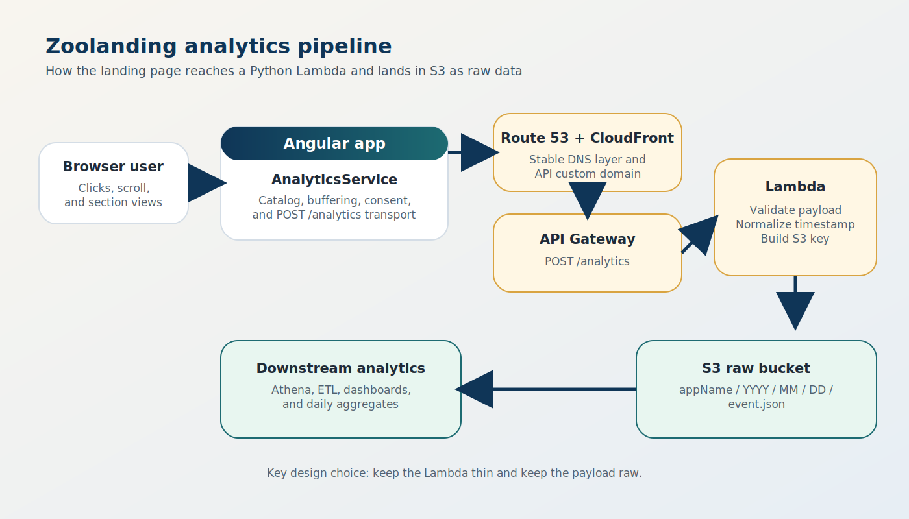
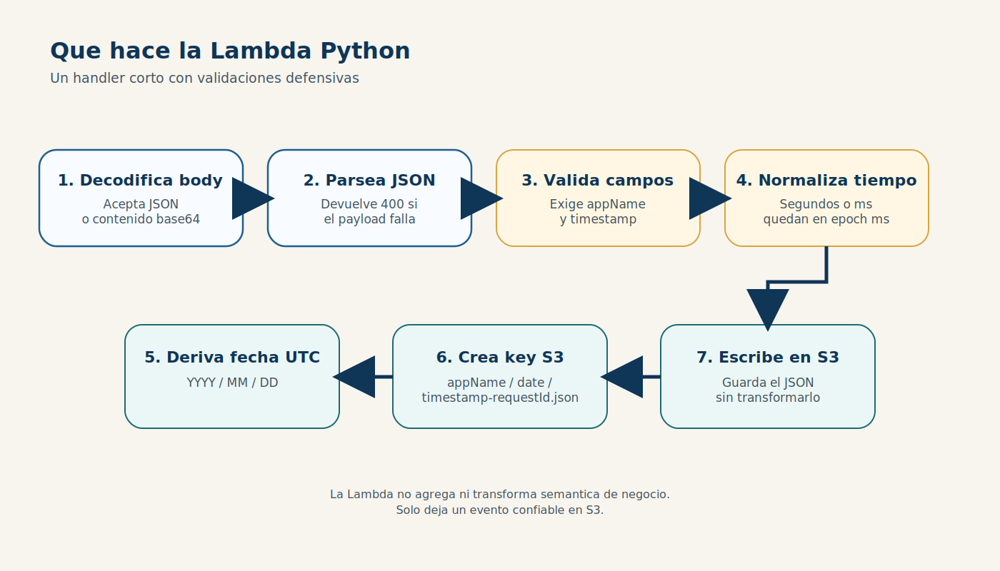
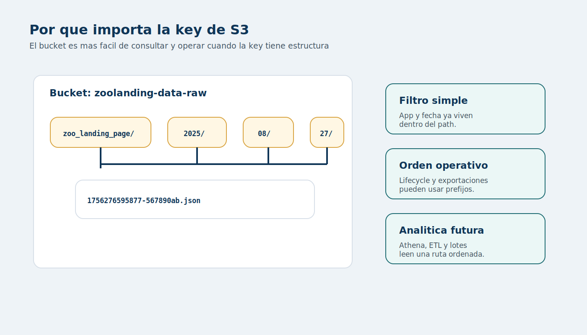
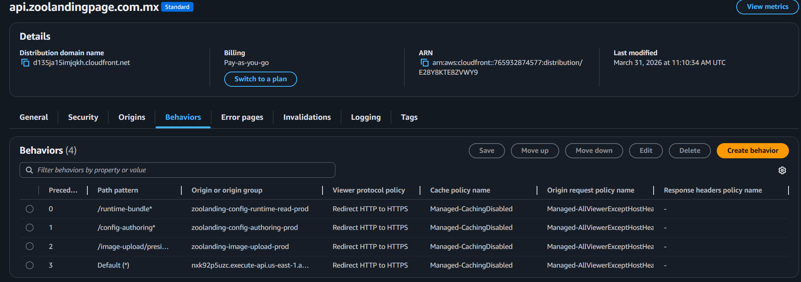
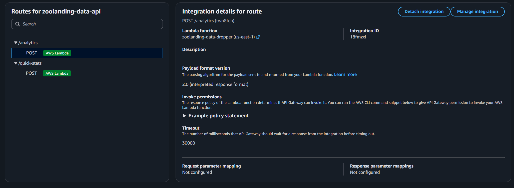
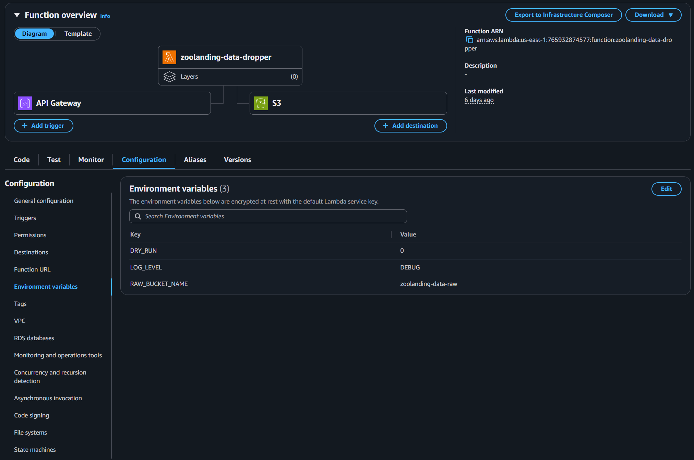
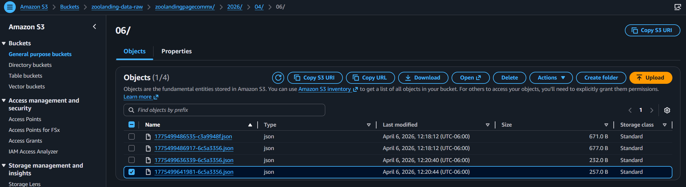
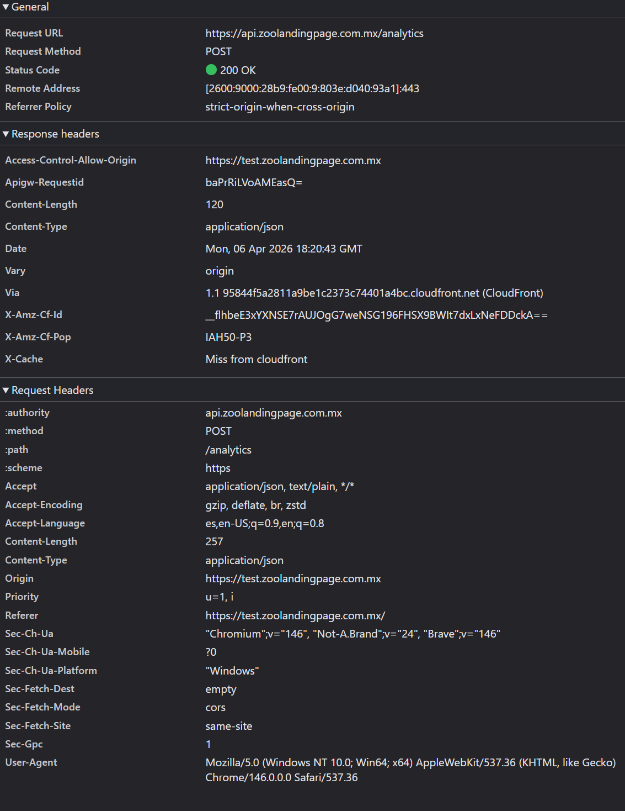

## Analytics con Python + AWS Lambda y S3 - Alec Jonathan Montaño Romero (Lynx Pardelle)

### Zoolandingpage y su Lambda de analytics

Python CDMX

TecNM Instituto Tecnológico de Gustavo A. Madero

---

## Objetivo de la charla

- Explicar como **Zoolandingpage** genera y transporta eventos de analytics.
- Profundizar en la Lambda Python **zoolanding-data-dropper-lambda**.
- Entender por que usamos **S3 como raw event store** y no una base de datos transaccional.
- Ver como encajan **CloudFront, API Gateway, Lambda y S3** dentro del flujo real.
- Salir con un patron reutilizable para proyectos pequeños y medianos.

---

## Agenda

1. Que es Zoolandingpage y que problema resuelve.
2. Flujo end to end de un evento.
3. Catalogo de eventos y envio desde Angular.
4. Deep dive de la Lambda de analytics.
5. Diseno de particiones en S3.
6. Servicios AWS alrededor del sistema.
7. Lecciones practicas, costos y limites.
8. Cierre y preguntas.

---

## Glosario rapido I

- **SAM**: AWS Serverless Application Model. Permite definir y desplegar infraestructura serverless como codigo.
- **DNS**: Domain Name System. Traduce nombres como `api.zoolandingpage.com.mx` a destinos resolubles.
- **CloudFront**: CDN y capa de distribucion que tambien puede exponer aliases y rutear a origins.
- **API Gateway**: Servicio que publica endpoints HTTP/REST y entrega requests a backend.
- **Lambda**: Funcion serverless que se ejecuta bajo demanda.
- **S3**: almacenamiento de objetos; aqui funciona como repositorio raw de eventos.

Volver al [indice de secciones](#indice-de-secciones).

---

## Glosario rapido II

- **CORS**: reglas que permiten o bloquean requests del navegador entre origenes distintos.
- **IAM**: Identity and Access Management. Define permisos, por ejemplo `s3:PutObject`.
- **Payload**: cuerpo de datos que viaja en el request.
- **UTC**: zona horaria neutral usada para evitar ambiguedades en fechas y particiones.
- **ETL**: Extract, Transform, Load. Proceso posterior para preparar datos para analitica.
- **Athena**: servicio de consulta sobre datos en S3 usando SQL.

Volver al [indice de secciones](#indice-de-secciones).

---

## Indice de secciones

- [Contexto del producto](#que-es-zoolandingpage)
- [Flujo del evento en frontend](#donde-nace-un-evento)
- [Lambda de analytics](#por-que-existe-una-lambda-dedicada-para-esto)
- [S3 y servicios AWS](#particionado-en-s3-estructura-de-la-key)
- [Cierre, costos y referencias](#costos-y-escalabilidad-por-que-este-patron-sirve)

Usalo como punto de regreso rapido cuando abras el glosario en medio de la charla.

---

## Que es Zoolandingpage

Zoolandingpage es una plataforma de landing pages **config-driven**.

- El frontend esta hecho en **Angular**.
- El contenido y parte del comportamiento se resuelven por configuracion.
- El mismo ecosistema incluye servicios para runtime config, authoring, image upload y analytics.
- La Lambda de esta charla no renderiza UI: **recibe eventos crudos y los deja listos para analitica posterior**.

Repos principales para esta charla: `zoolandingpage` y `zoolanding-data-dropper-lambda`.

---

## El problema de analytics en una landing

Cuando una landing empieza a crecer, casi siempre aparecen estas preguntas:

- Que CTA se esta usando realmente.
- Que secciones si se alcanzan a leer.
- En que idioma, tema o ruta ocurre la interaccion.
- Como guardar datos para analisis posterior sin meter logica pesada en frontend.
- Como hacerlo con bajo costo y una arquitectura simple.

La idea aqui fue separar dos cosas:

- **captura de eventos en frontend**
- **persistencia cruda y barata en backend**

---

## Vista general del sistema



El flujo principal de la charla es Browser -> Angular -> CloudFront/API -> API Gateway -> Lambda -> S3.

---

## Donde nace un evento

En `AnalyticsService` del frontend tenemos dos ideas clave:

- eventos emitidos por componentes o detectados automaticamente
- un punto central que decide como enviarlos

Ejemplos reales del catalogo:

- `page_view`
- `nav_click`
- `cta_click`
- `section_view`
- `scroll_depth`
- `whatsapp_click`

Fuente: [zoolandingpage/src/app/shared/services/analytics.events.ts](../../zoolandingpage/src/app/shared/services/analytics.events.ts)

---

## El frontend no solo hace click tracking

`AnalyticsService` tambien automatiza varios patrones:

- seguimiento de **scroll depth** por milestones
- deteccion de **section_view**
- tracking de navegacion por anchors
- cola de eventos pendiente de consentimiento
- remapeo de nombres y categorias segun configuracion

Esto importa porque la Lambda puede mantenerse minima si el frontend ya envia un payload consistente.

---

## Contrato minimo hacia la Lambda

La Lambda de analytics solo exige dos campos:

```json
{
  "appName": "zoo_landing_page",
  "timestamp": 1756276595877,
  "name": "cta_click"
}
```

- `appName`: identificador estable de la app o landing.
- `timestamp`: puede llegar en segundos o milisegundos.
- todo lo demas se conserva tal cual para analisis posterior.

Eso reduce el acoplamiento entre frontend y backend.

---

## Que recibe realmente Lambda desde API Gateway

```python
sample_event = {
    "isBase64Encoded": False,
    "body": json.dumps(sample_payload),
}
```

Puntos importantes:

- API Gateway manda un evento proxy-like.
- El body llega como string JSON.
- A veces puede venir base64 si el invocador lo marca asi.
- El `aws_request_id` del contexto se reutiliza para la key final.

Fuente: [zoolanding-data-dropper-lambda/local_test.py](../local_test.py)

---

## Por que existe una Lambda dedicada para esto

- Mantiene al frontend libre de credenciales AWS.
- Centraliza validacion minima y convenciones de almacenamiento.
- Permite dejar el payload **raw y append-only**.
- Facilita evolucionar despues con ETL, Athena, Glue o agregados.
- Es mucho mas barata y flexible que meter cada evento en una API mas pesada.

La Lambda no intenta hacer BI en tiempo real.

Su trabajo es: **recibir, validar, nombrar bien y guardar**.

---

## Flujo interno de la Lambda



---

## Paso 1: decodificar y validar entrada

```python
def _decode_body(event: Dict[str, Any]) -> str:
    body = event.get("body")
    if body is None or body == "":
        raise ValueError("Missing body")
    is_b64 = event.get("isBase64Encoded", False)
    if is_b64:
        if isinstance(body, str):
            return base64.b64decode(body).decode("utf-8")
        raise ValueError("Body is base64Encoded but not a string")
```

- valida que exista body
- soporta body normal y body base64
- deja el resto del handler trabajando con una sola representacion: `str`

Esto elimina una clase completa de errores temprano.

---

## Paso 2: timestamp defensivo

```python
def _normalize_timestamp_to_ms(ts: Any) -> int:
    if not isinstance(ts, (int, float)) or not math.isfinite(ts):
        raise ValueError("Missing or invalid timestamp")
    ts_ms = int(ts if ts >= 10**12 else ts * 1000)
    return ts_ms
```

- si llega en ms, se respeta
- si llega en segundos, se convierte
- no obliga a todos los clientes a estar perfectamente alineados

Es una pequena decision, pero muy util cuando varios emisores publican eventos.

---

## Paso 3: UTC y particiones por fecha

```python
def _derive_date_parts(ts_ms: int):
    dt = datetime.fromtimestamp(ts_ms / 1000.0, tz=timezone.utc)
    return dt.strftime("%Y"), dt.strftime("%m"), dt.strftime("%d")
```

- se usa **UTC** para evitar ambiguedades de zona horaria
- se derivan `YYYY/MM/DD`
- eso alimenta la key de S3 y deja el dataset listo para consultas por fecha

---

## Paso 4: construir la key de S3

```python
key = f"{app_name}/{yyyy}/{mm}/{dd}/{ts_ms}-{short_reqId}.json"
```

La convencion tiene varias ventajas:

- agrupa por aplicacion
- particiona por fecha
- conserva orden temporal razonable
- agrega un sufijo unico basado en request id

Ejemplo:

```text
zoo_landing_page/2025/08/27/1756276595877-567890ab.json
```

---

## Paso 5: guardar el payload original

```python
s3.put_object(
    Bucket=RAW_BUCKET_NAME,
    Key=key,
    Body=body_str.encode("utf-8"),
    ContentType="application/json",
)
```

La decision importante aqui no es el `put_object`.

La decision importante es: **guardar el JSON original sin reescribirlo**.

- facilita auditoria
- evita perder campos nuevos
- deja la normalizacion fuerte para una fase posterior

---

## Ejemplo completo: evento -> objeto en S3

### Payload enviado

```json
{
  "appName": "zoo_landing_page",
  "timestamp": 1756276595877,
  "name": "cta_click",
  "category": "cta",
  "label": "hero_primary"
}
```

### Resultado esperado

```text
Bucket: zoolanding-data-raw
Key: zoo_landing_page/2025/08/27/1756276595877-567890ab.json
```

El sufijo final depende del `aws_request_id`; aqui es ilustrativo.

---

## Particionado en S3: estructura de la key



---

## Particionado en S3: por que ayuda

- almacenamiento barato
- append-only natural
- facil de versionar, expirar o procesar despues
- muy buen punto de integracion para pipelines posteriores

---

## Servicios AWS: panorama del flujo

### Entrada y enrutamiento

- Route 53
- CloudFront
- API Gateway

### Ejecucion y datos

- Lambda
- S3
- DynamoDB en servicios de config

Glosario rapido: [DNS](#glosario-rapido-i), [CloudFront](#glosario-rapido-i), [API Gateway](#glosario-rapido-i), [Lambda](#glosario-rapido-i), [S3](#glosario-rapido-i)

---

## Servicios AWS: rol de cada pieza

- **CloudFront** expone dominios estables como `api.zoolandingpage.com.mx`.
- **API Gateway** publica y enruta `POST /analytics`.
- **Lambda** aplica la logica minima y construye la key final.
- **S3** conserva el payload crudo para analitica posterior.
- **Route 53** resuelve el dominio hacia la distribucion correspondiente.

Glosario rapido: [DNS](#glosario-rapido-i), [CloudFront](#glosario-rapido-i), [API Gateway](#glosario-rapido-i), [Lambda](#glosario-rapido-i), [S3](#glosario-rapido-i)

---

## CloudFront y DNS en produccion



La captura ayuda a explicar alias, behaviors y el dominio estable de la capa de acceso.

Glosario rapido: [DNS](#glosario-rapido-i), [CloudFront](#glosario-rapido-i)

---

## CloudFront y DNS: que conviene explicar

- Route 53 es la capa DNS que apunta el dominio hacia la distribucion.
- CloudFront unifica aliases y behaviors para distintos paths del sistema.
- En esta charla su papel es de borde y routing, no de logica de analytics.

Referencia: [zoolandingpage/docs/06-deployment.md](../../zoolandingpage/docs/06-deployment.md)

---

## API Gateway: la puerta de entrada



Aqui puedes mostrar visualmente la ruta que recibe el evento antes de invocar la Lambda.

Glosario rapido: [API Gateway](#glosario-rapido-i), [CORS](#glosario-rapido-ii)

---

## API Gateway: que leer en la captura

- Aqui vive la ruta `POST /analytics`.
- API Gateway recibe el request del navegador y lo entrega a la Lambda en formato proxy-like.
- Tambien es donde se refleja el soporte de CORS para `POST` y `OPTIONS`.

Referencia: [zoolanding-data-dropper-lambda/template.yaml](../template.yaml)

---

## Lambda: configuracion y entorno



La captura deja ver el handler y la configuracion desacoplada de la logica.

Glosario rapido: [Lambda](#glosario-rapido-i), [IAM](#glosario-rapido-ii)

---

## Lambda: que resaltar

- La funcion se publica con handler `lambda_function.lambda_handler`.
- Variables como `RAW_BUCKET_NAME` y `LOG_LEVEL` separan configuracion de codigo.
- Esto permite cambiar bucket o verbosidad sin tocar la logica del handler.

Referencia: [zoolanding-data-dropper-lambda/template.yaml](../template.yaml)

---

## SAM: infraestructura como codigo

```yaml
DataDropperApi:
  Type: AWS::Serverless::Api

DataDropperFunction:
  Type: AWS::Serverless::Function
  Properties:
    Handler: lambda_function.lambda_handler
```

Glosario rapido: [SAM](#glosario-rapido-i), [Lambda](#glosario-rapido-i)

---

## SAM: parametros operativos del stack

- runtime `python3.13`
- timeout `10s`
- memoria `256 MB`
- CORS para `POST,OPTIONS`
- politica IAM con `s3:PutObject` solo sobre el bucket destino

Esto hace reproducible el stack y evita configuracion manual dispersa.

Referencias:

- [zoolanding-data-dropper-lambda/template.yaml](../template.yaml)
- [zoolandingpage/docs/06-deployment.md](../../zoolandingpage/docs/06-deployment.md)

---

## Seguridad y minimalismo utiles

- el rol IAM solo necesita `s3:PutObject`
- el handler distingue errores del cliente y errores del servidor
- existe `DRY_RUN` para desarrollo local
- el logger es estructurado y util para CloudWatch
- la Lambda no intenta interpretar toda la semantica del negocio

Glosario rapido: [IAM](#glosario-rapido-ii), [CORS](#glosario-rapido-ii)

---

## Que mostraria en vivo del codigo

1. `_decode_body` para explicar interoperabilidad con API Gateway.
2. `_normalize_timestamp_to_ms` para hablar de clientes heterogeneos.
3. `_derive_date_parts` para justificar UTC.
4. construccion de `key` para explicar particionado.
5. `put_object` para remarcar el almacenamiento raw.
6. manejo de `ValueError` vs excepcion general.

La Lambda es corta, y eso ayuda mucho a explicarla completa en conferencia.

---

## S3: resultado real del almacenamiento



Esta captura sirve para aterrizar que la key no es una idea teorica: existe como prefijo real dentro del bucket.

Glosario rapido: [S3](#glosario-rapido-i), [UTC](#glosario-rapido-ii)

---

## S3: que leer en la captura

- Se aprecia el bucket crudo y la convencion de particiones por prefijo.
- Esta estructura hace facil navegar por aplicacion y por fecha.
- Es exactamente la razon por la que la key se construye con `appName/YYYY/MM/DD/...`.

---

## DevTools: el request desde el frontend



Esta captura conecta lo que pasa en Angular con el salto hacia AWS.

Glosario rapido: [Payload](#glosario-rapido-ii), [API Gateway](#glosario-rapido-i)

---

## DevTools: que leer en la captura

- Aqui puedes demostrar que el evento realmente sale desde Zoolandingpage.
- Es util para conectar visualmente frontend, endpoint y payload.
- Si haces demo en vivo, esta captura ayuda a que la audiencia entienda el salto entre Angular y AWS.

Referencia sugerida en vivo: [zoolandingpage/src/app/shared/services/analytics.service.ts](../../zoolandingpage/src/app/shared/services/analytics.service.ts)

---

## Costos y escalabilidad: por que este patron sirve

- Lambda cobra por invocacion y tiempo real de ejecucion.
- S3 cobra muy barato por almacenamiento de objetos pequenos.
- No necesitamos una base de datos caliente para cada click.
- El procesamiento pesado puede ocurrir despues, cuando realmente haga falta.

Este patron funciona bien cuando:

- quieres observabilidad rapida
- quieres costo bajo
- no necesitas respuesta analitica compleja en tiempo real

---

## Lecciones aprendidas

- Un backend pequeno y opinionado puede ser mas util que uno muy inteligente.
- Guardar raw data primero da flexibilidad futura.
- La convencion de key en S3 importa mucho mas de lo que parece.
- Tener infraestructura declarada en SAM evita drift operativo.
- Centralizar analytics en frontend reduce ruido en componentes.

---

## Ideas para evolucionar esto

- pipeline posterior con Athena o Glue
- agregados diarios por landing
- alertas o dashboards sobre eventos criticos
- deduplicacion si algun cliente reintenta
- compresion o metadata adicional en objetos S3

Lo importante es que la base ya esta bien puesta.

---

## Referencias del codigo

- [zoolandingpage/src/app/shared/services/analytics.service.ts](../../zoolandingpage/src/app/shared/services/analytics.service.ts)
- [zoolandingpage/src/app/shared/services/analytics.events.ts](../../zoolandingpage/src/app/shared/services/analytics.events.ts)
- [zoolandingpage/docs/06-deployment.md](../../zoolandingpage/docs/06-deployment.md)
- [zoolandingpage/docs/08-data-dropper-lambda.md](../../zoolandingpage/docs/08-data-dropper-lambda.md)
- [zoolanding-data-dropper-lambda/lambda_function.py](../lambda_function.py)
- [zoolanding-data-dropper-lambda/template.yaml](../template.yaml)
- [zoolanding-data-dropper-lambda/local_test.py](../local_test.py)

---

## Gracias

### Analytics con Python + AWS Lambda y S3

Preguntas, critica tecnica y comentarios bienvenidos.
